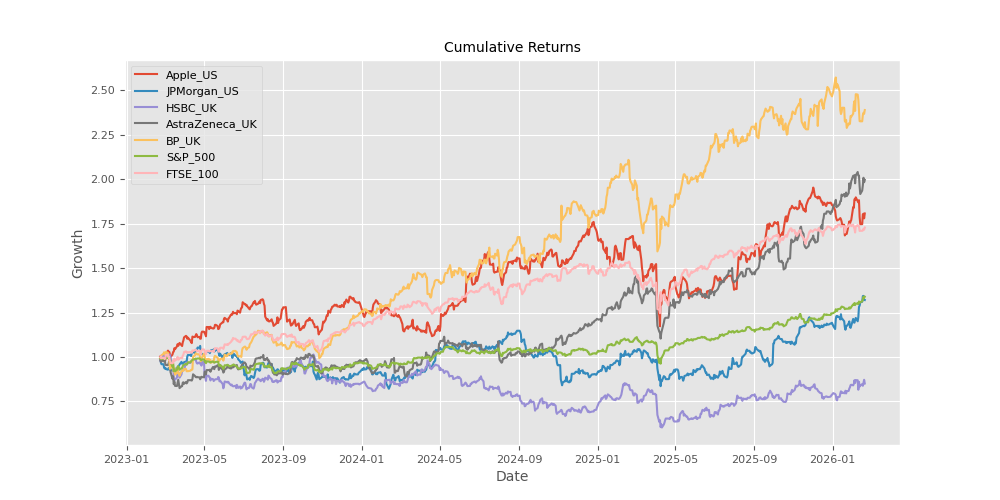
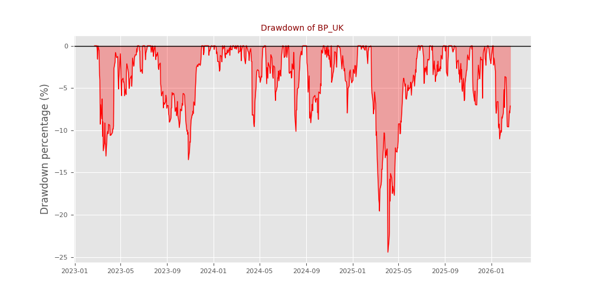
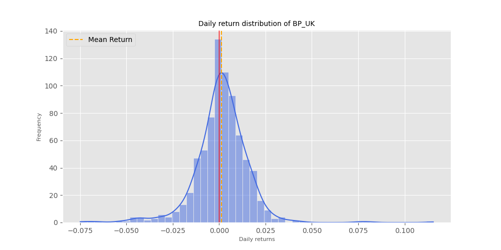

# 📈 Investment Portfolio Risk & Return Analysis

## 🌟 Project Overview
As part of my passion for Finance & Investment, I built this tool to move beyond just looking at stock prices. This project focuses on answering the question: *Is this stock worth investing?*

Using Python, I analyzed a diversified portfolio of US and UK equities (AAPL, JPM, HSBA.L, AZN.L, BP.L) and compared their performance against the S&P 500 and FTSE 100 benchmarks over the last 3 years.

### 📈 Business Impact
- **Efficiency:** Reduces data gathering time from 30 minutes to 5 seconds.
- **Accuracy:** Eliminates human error in manual data entry by using direct API integration.
- **Scalability:** The framework can be easily adapted for multiple tickers and different valuation methodologies.

## 🧠 My Analytical Process
In this project, I didn't just write code; I applied these financial logics:
- **Data Engineering**: Handled missing values (due to different market holidays in the UK/US) using the **Forward Fill** method to maintain time-series continuity.
- **Risk Metrics**: Implemented **Sharpe Ratio** calculation using the 10-Year US Treasury yield as the Risk-Free Rate ($R_f$) to identify which stocks truly provided value.
- **Performance Evaluation**: Calculated **CAGR**, **Volatility**, and **Calmar Ratio** to provide a multi-dimensional view of portfolio.
- **Downside Protection**: Calculated **Maximum Drawdown** to simulate the "worst-case scenario" for an investor during market corrections.

## 🛠 Tech Stack
- **Python** (Pandas, NumPy)
- **Visualization**: Matplotlib, Seaborn
- **Data Source**: Yahoo Finance API (`yfinance`)

## 📊 Key Insights
Running this analysis revealed that:
1. Some high-return assets also came with significant **Maximum Drawdowns**, which might not suit a conservative investor.
2. The **Calmar Ratio** provided a clearer picture of recovery performance than looking at annual returns alone.
3. The **Sharpe Ratio** effectively highlighted which assets provided the best return per unit of risk, often outperforming simple benchmarks.

### 📊 Performance charts




## 🚀 How to Run locally
1. Clone the repo:
   ```bash
   git clone https://github.com/maitran-12/Investment-portfolio-analysis.git

pip install -r requirements.txt

python investment_portfolio_analysis.py

`Developed by Ngoc Mai Tran, to turn raw market data into actionable investment insights.`
